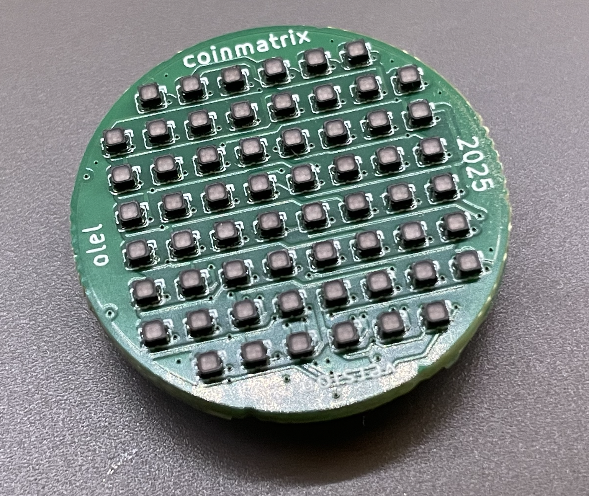
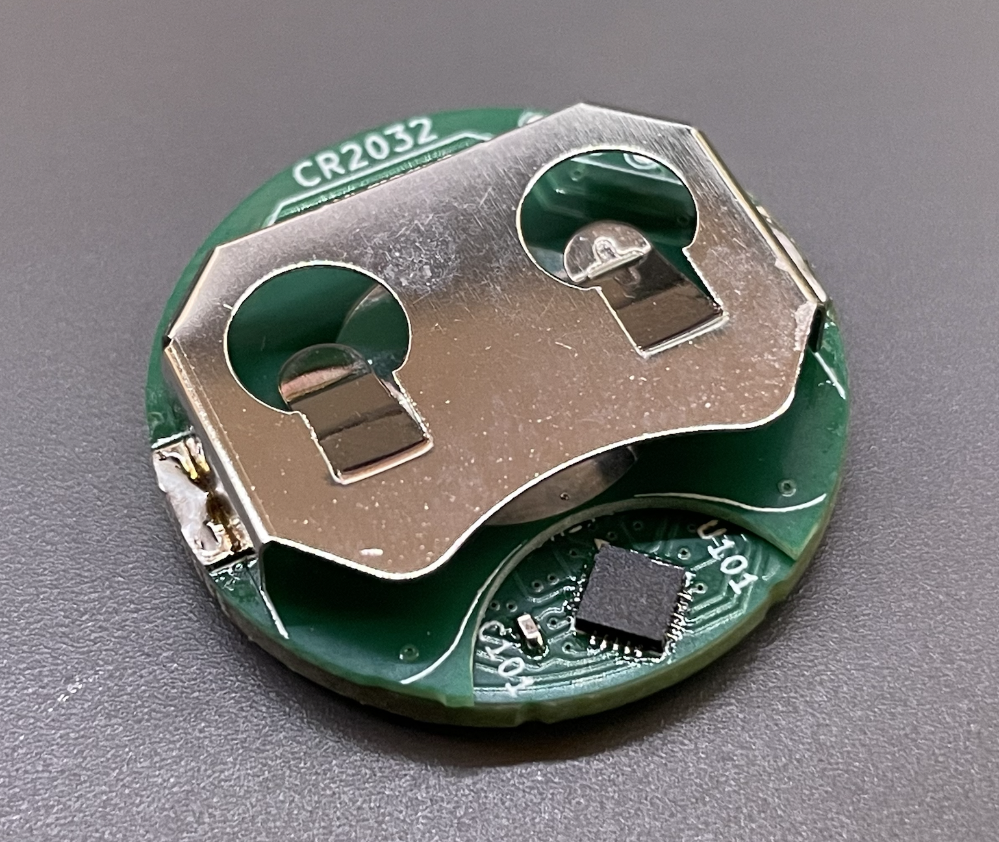

# CoinMatrix

CR2032 sized 8x8 pixel LED matrix driven by a CH32V003. This repo contains
firmware and hardware design files.

## Build the firmware
To build the firmware use the Makefile in the firmware subdirectory. To build
the project you need to clone ch32fun which is included as submodule in this
repo. To do that, run this command:
```
git submodule update --init
```

to build to firmware binary and flash it simply run `make` inside the firmware
directory.

## Hardware
You can find KiCad design files for the current hardware revision in the
hardware/ folder. ⚠️ V2 is currently untested and might have errors!

To view the projects in your browser you can use [KiCanvas](https://github.com/theacodes/kicanvas):
* [matrix board](https://kicanvas.org/?github=https%3A%2F%2Fgithub.com%2Folell%2FCoinMatrix%2Ftree%2Fmain%2Fhardware%2Fcoinmatrix)
* [battery board](https://kicanvas.org/?github=https%3A%2F%2Fgithub.com%2Folell%2FCoinMatrix%2Ftree%2Fmain%2Fhardware%2Fcoinmatrix_battery)
* [spacer](https://kicanvas.org/?github=https%3A%2F%2Fgithub.com%2Folell%2FCoinMatrix%2Ftree%2Fmain%2Fhardware%2Fcoinmatrix_spacer)

### Version 1 Pictures



## License
The hardware is licensed under [CC BY-NC 4.0](https://creativecommons.org/licenses/by-nc/4.0/) you can find a copy of the license text in the LICENSE_HARDWARE file.

The firmware source code is licensed under MIT license, you can find a copy of the license text in the LICENSE file.